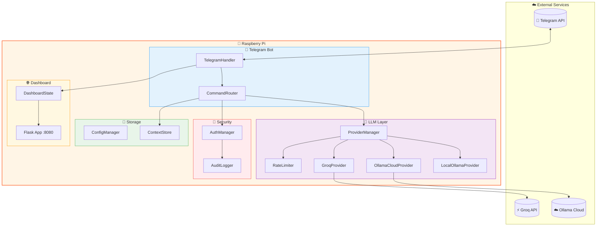
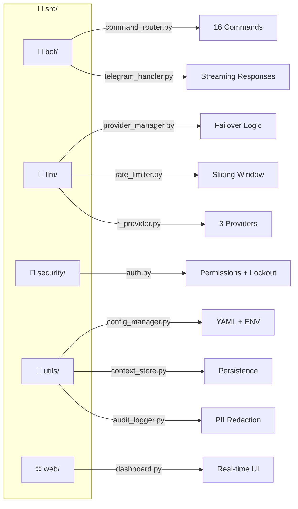
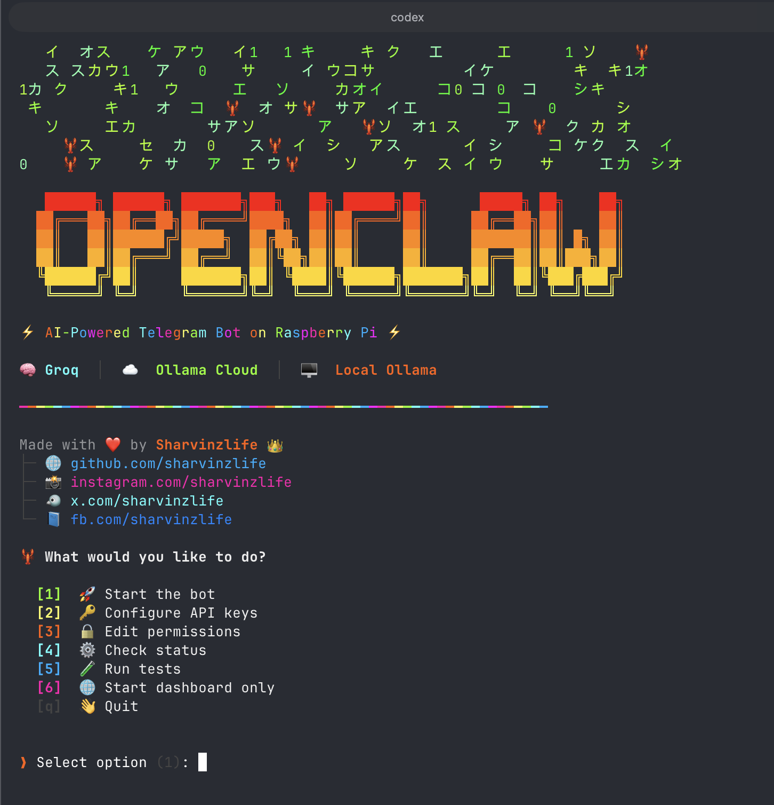
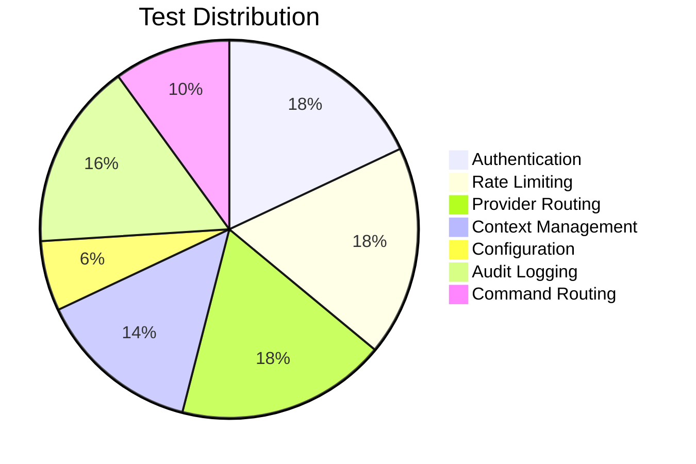
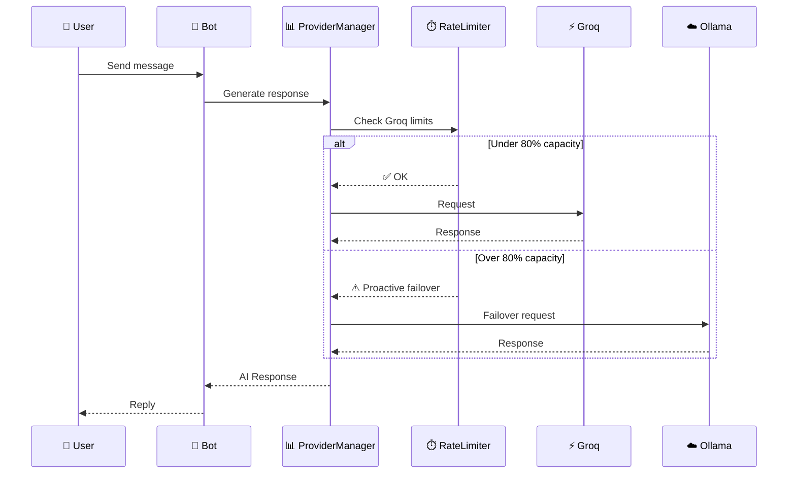

<p align="center">
  
</p>

<h1 align="center">🤖 OpenClaw-On-Pi</h1>

<p align="center">
  <strong>AI-Powered Telegram Bot with Multi-Provider LLM Support</strong><br>
  <em>Designed & Optimized for Raspberry Pi</em>
</p>

<p align="center">
  <a href="#-features">Features</a> •
  <a href="#-quick-start">Quick Start</a> •
  <a href="#-architecture">Architecture</a> •
  <a href="#-commands">Commands</a> •
  <a href="#-dashboard">Dashboard</a>
</p>

<p align="center">
  
  
  
  
</p>

<p align="center">
  
  
  
  
  
</p>

---

## 🌟 What is OpenClaw?

OpenClaw is a **production-ready AI chatbot** that runs on your Raspberry Pi and connects to Telegram. It intelligently routes requests between multiple LLM providers (Groq, Ollama Cloud, Local Ollama) with automatic failover, rate limiting, and a beautiful web dashboard for monitoring.

```
┌─────────────────────────────────────────────────────────────────┐
│  🍓 Your Raspberry Pi                                           │
│  ┌─────────────┐    ┌─────────────┐    ┌─────────────┐         │
│  │   Telegram  │───▶│  OpenClaw   │───▶│  Dashboard  │         │
│  │     Bot     │    │   Engine    │    │   :8080     │         │
│  └─────────────┘    └──────┬──────┘    └─────────────┘         │
│                            │                                    │
│         ┌──────────────────┼──────────────────┐                │
│         ▼                  ▼                  ▼                │
│  ┌─────────────┐    ┌─────────────┐    ┌─────────────┐         │
│  │    Groq    │    │   Ollama    │    │   Local     │         │
│  │  (Primary)  │    │   Cloud     │    │   Ollama    │         │
│  │     ⚡      │    │     ☁️      │    │     🖥️      │         │
│  └─────────────┘    └─────────────┘    └─────────────┘         │
└─────────────────────────────────────────────────────────────────┘
```

---

## ✨ Features

| Feature | Description |
|---------|-------------|
| 🧠 **Multi-Provider AI** | Groq (blazing fast), Ollama Cloud (18+ models), Local Ollama (privacy) |
| 🔄 **Smart Failover** | Automatic switching on rate limits or errors |
| ⚡ **Rate Limiting** | Sliding window algorithm with proactive failover at 80% |
| 🔐 **Permission System** | Admin, User, Guest roles with granular access |
| 💬 **Context Memory** | Persistent conversations with token-aware truncation |
| 📊 **Web Dashboard** | Beautiful glassy ivory-orange monitoring UI |
| 📝 **Audit Logging** | Complete activity tracking with PII redaction |
| 🎨 **Professional CLI** | Colorful interface with emojis |
| 🧪 **50 Property Tests** | Comprehensive test coverage with Hypothesis |

---

## 🎬 CLI Preview

<p align="center">
  
</p>

---

## 🚀 Quick Start

### Install & Run (3 commands)

```bash
git clone https://github.com/sharvinzlife/OpenClaw-On-Pi.git
cd OpenClaw-On-Pi
./setup
```

`./setup` automatically handles everything:
- ✅ Checks Python 3.9+ is installed
- ✅ Installs [uv](https://docs.astral.sh/uv/) (fast Python package manager) if not present
- ✅ Installs all dependencies (`uv sync`)
- ✅ Creates `config/.env` from template
- ✅ Launches the interactive CLI wizard to configure API keys

After setup, start the bot:

```bash
./start
```

Dashboard available at `http://your-pi-ip:8080`

> **No manual dependency installation needed.** `./setup` and `./start` handle everything automatically.

### Management Scripts

| Script | What it does |
|--------|-------------|
| `./setup` | Install deps + launch CLI wizard (run once) |
| `./start` | Start bot + dashboard (auto-installs deps if needed) |
| `./stop` | Stop the bot and free port 8080 |
| `./restart` | Restart the bot |

### Manual Installation (Advanced)

If you prefer full control:

```bash
# 1. Clone
git clone https://github.com/sharvinzlife/OpenClaw-On-Pi.git
cd OpenClaw-On-Pi

# 2. Install uv (Python package manager)
curl -LsSf https://astral.sh/uv/install.sh | sh

# 3. Install all dependencies
uv sync

# 4. Configure
cp config/.env.template config/.env
nano config/.env                    # Add your API keys
nano config/permissions.yaml        # Add your Telegram user ID as admin

# 5. Start
./start
```

### What You Need

| Requirement | Where to get it |
|-------------|----------------|
| 🍓 Raspberry Pi (or any Linux) | Python 3.9+ required |
| 🤖 Telegram Bot Token | [@BotFather](https://t.me/BotFather) on Telegram |
| ⚡ Groq API Key | [console.groq.com](https://console.groq.com) (free) |
| ☁️ Ollama Cloud Key (optional) | [ollama.com/settings/keys](https://ollama.com/settings/keys) |
| 🔴 Reddit API (optional) | [reddit.com/prefs/apps](https://www.reddit.com/prefs/apps) (free, "script" type) |

---

## 🏗️ Architecture




### 📦 Module Structure



---

## ⚙️ Configuration

### 🔑 API Keys (`config/.env`)

```env
# Required
TELEGRAM_BOT_TOKEN=your_bot_token_from_botfather
GROQ_API_KEY=your_groq_api_key

# Optional — Ollama Cloud (access 18+ cloud models)
OLLAMA_API_KEY=your_ollama_cloud_api_key
```

### 👤 Get Your Telegram User ID

1. Message [@userinfobot](https://t.me/userinfobot) on Telegram
2. Copy your user ID
3. Add to `config/permissions.yaml`:

```yaml
admins:
  - 123456789  # Your user ID here
```

---

## 🎮 CLI & Management

### Shell Scripts

| Command | Description |
|---------|-------------|
| `./setup` | 🔧 First-time setup — launches the interactive CLI wizard |
| `./start` | 🚀 Start the bot + dashboard (kills any existing instance) |
| `./stop` | 🛑 Stop the bot and free port 8080 |
| `./restart` | 🔄 Restart the bot (stop + start) |

### Interactive CLI Wizard (`./setup`)

The CLI wizard provides a full menu-driven interface:

| Option | Description |
|--------|-------------|
| `[1]` 🚀 Start the bot | Launch bot with startup sequence |
| `[2]` �� Configure API keys | Menu-based key selector with links to get keys |
| `[3]` 🔒 Edit permissions | Manage admin/user Telegram IDs |
| `[4]` ⚙️ Check status | Verify config, API keys, and provider health |
| `[5]` 🧪 Run tests | Execute property-based test suite |
| `[6]` 🌐 Start dashboard only | Launch web dashboard without the bot |

### API Key Configuration

The key configurator shows status for each key and provides direct links:

| Key | Where to Get |
|-----|-------------|
| 🤖 Telegram Bot Token | [@BotFather](https://t.me/BotFather) on Telegram |
| ⚡ Groq API Key | [console.groq.com/keys](https://console.groq.com/keys) |
| 🔑 Ollama Cloud API Key | [ollama.com/settings/keys](https://ollama.com/settings/keys) |

### CLI Preview

<p align="center">
  
</p>

---

## 🤖 Telegram Commands


### 👤 Guest Commands
| Command | Description |
|---------|-------------|
| `/start` | 👋 Welcome message and quick start guide |
| `/help` | 📚 Show available commands for your role |

### 👥 User Commands
| Command | Description |
|---------|-------------|
| `/status` | 📊 Bot status and current provider |
| `/provider` | 🧠 Show active AI provider details |
| `/switch <name>` | 🔄 Switch to different AI provider |
| `/models` | 📋 List available AI models |
| `/reset` | 🗑️ Clear your conversation history |
| `/quota` | 📈 Check your rate limit status |

### 👑 Admin Commands
| Command | Description |
|---------|-------------|
| `/stats` | 📊 Global usage statistics |
| `/users` | 👥 List all active users |
| `/broadcast <msg>` | 📢 Send message to all users |
| `/reload` | 🔄 Reload configuration files |
| `/audit [n]` | 📝 View last n audit log entries |
| `/health` | 🏥 System health check |
| `/ban <id>` | 🚫 Ban a user |
| `/unban <id>` | ✅ Unban a user |

---

## 📊 Web Dashboard

Access the monitoring dashboard at `http://your-pi-ip:8080`

### Features

- 🟢 **Real-time Status** - Bot online/offline indicator
- ⏱️ **Uptime Counter** - How long the bot has been running
- 💬 **Message Counter** - Total messages processed
- 🎯 **Token Usage** - Tokens consumed across providers
- 👥 **Active Users** - Currently active user count
- 🧠 **Provider Status** - Health of each AI provider with active toggle
- 🔄 **Model Switching** - Change AI models per provider from the UI
- 📊 **Rate Limits** - Visual progress bars for limits
- 📝 **Activity Feed** - Recent bot activity stream

### Design

Beautiful **glassy ivory-orange** design with:
- Animated floating orbs background
- Glassmorphism panels
- Responsive layout for mobile
- Auto-refresh every 5 seconds

---

## ☁️ Ollama Cloud Models

OpenClaw supports 18+ cloud models via [Ollama Cloud](https://ollama.com), including:

| Model | Size | Best For |
|-------|------|----------|
| DeepSeek V3.2 | 671B | General reasoning (default) |
| GLM-5 | - | Chinese + English tasks |
| GLM-4.7 Flash | - | Fast Chinese + English |
| Kimi K2.5 | - | Long context reasoning |
| Cogito 2.1 | 671B | Deep thinking |
| Mistral Large 3 | 675B | Multilingual, code |
| Qwen3 Coder | 480B | Code generation |
| Qwen3 Coder Next | - | Latest code model |
| GPT-OSS | 120B | General purpose |
| Gemma 3 | 27B | Lightweight tasks |
| LFM 2.5 Thinking | - | Reasoning |

Switch models from the web dashboard or via Telegram commands.

---

## 🍓 Raspberry Pi Compatibility

| Model | Architecture | Status |
|-------|--------------|--------|
| Pi 5 | ARM64 | ✅ Tested |
| Pi 4 | ARM64 | ✅ Tested |
| Pi 3 | ARM64/ARM32 | ✅ Compatible |
| Pi Zero 2 W | ARM64 | ✅ Compatible |
| Pi Zero W | ARM32 | ⚠️ Limited (no local Ollama) |

### Supported Operating Systems

- 🥧 **DietPi** (Recommended - lightweight)
- 🍓 **Raspberry Pi OS** (64-bit or 32-bit)
- 🐧 **Ubuntu Server** (ARM64)
- 🐧 **Debian** (ARM64)

---

## 🧪 Testing

OpenClaw includes **50 property-based tests** using [Hypothesis](https://hypothesis.readthedocs.io/).

```bash
# Run all tests
./start test

# Or with pytest directly
.venv/bin/python -m pytest tests/ -v

# Run specific test file
.venv/bin/python -m pytest tests/property/test_auth_properties.py -v
```

### Test Coverage



| Module | Tests | Coverage |
|--------|-------|----------|
| 🔐 Authentication | 9 | Allowlist, lockout, hierarchy |
| ⚡ Rate Limiting | 9 | Sliding window, failover threshold |
| 🧠 Provider Routing | 9 | Priority, failover, recovery |
| 💬 Context Store | 7 | Isolation, truncation, persistence |
| ⚙️ Configuration | 3 | Loading, validation |
| 📝 Audit Logging | 8 | Completeness, PII redaction |
| 🎮 Commands | 5 | Permission filtering |

---

## 📁 Project Structure

```
OpenClaw-On-Pi/
├── 📁 config/                    # Configuration files
│   ├── .env.template            # API keys template
│   ├── config.yaml              # App settings
│   ├── providers.yaml           # LLM provider config
│   └── permissions.yaml         # User permissions
│
├── 📁 src/                       # Source code
│   ├── 📁 bot/                   # Telegram bot
│   │   ├── command_router.py    # 16 commands
│   │   └── telegram_handler.py  # Message handling
│   │
│   ├── 📁 llm/                   # LLM providers
│   │   ├── base_provider.py     # Abstract base
│   │   ├── groq_provider.py     # Groq integration
│   │   ├── ollama_cloud_provider.py
│   │   ├── ollama_local_provider.py
│   │   ├── provider_manager.py  # Failover logic
│   │   └── rate_limiter.py      # Sliding window
│   │
│   ├── 📁 security/              # Security
│   │   └── auth.py              # Permissions + lockout
│   │
│   ├── 📁 utils/                 # Utilities
│   │   ├── config_manager.py    # YAML + ENV loading
│   │   ├── context_store.py     # Conversation memory
│   │   └── audit_logger.py      # Activity logging
│   │
│   ├── 📁 web/                   # Dashboard
│   │   └── dashboard.py         # Flask app
│   │
│   ├── cli.py                   # Professional CLI
│   └── main.py                  # Entry point
│
├── 📁 tests/                     # Property-based tests
│   └── 📁 property/              # Hypothesis tests
│
├── 📄 start                      # Start the bot
├── 📄 stop                       # Stop the bot
├── 📄 restart                    # Restart the bot
├── 📄 setup                      # First-time setup wizard
├── 📄 pyproject.toml             # Project config (uv)
└── 📄 README.md                  # You are here!
```

---

## 🔄 Provider Failover Flow



---

## 🛡️ Security Features

- 🔐 **Role-based Access Control** - Admin, User, Guest permissions
- 🚫 **Auth Failure Lockout** - Automatic lockout after failed attempts
- 🔒 **PII Redaction** - Sensitive data masked in logs
- 📝 **Audit Trail** - Complete activity logging
- 🔑 **API Key Protection** - Keys stored in .env, never logged

---

## 📈 Roadmap

- [x] Multi-provider LLM support
- [x] Smart failover with rate limiting
- [x] Web dashboard
- [x] Property-based testing
- [x] Ollama Cloud support (18+ models)
- [x] CLI setup wizard
- [x] UV-based package management
- [x] Dashboard model switching
- [ ] Voice message support
- [ ] Image generation (DALL-E/Stable Diffusion)
- [ ] WhatsApp integration
- [ ] Discord bot
- [ ] Prometheus metrics
- [ ] Docker support

---

## 🤝 Contributing

Contributions are welcome! Please feel free to submit a Pull Request.

1. Fork the repository
2. Create your feature branch (`git checkout -b feature/AmazingFeature`)
3. Commit your changes (`git commit -m 'Add some AmazingFeature'`)
4. Push to the branch (`git push origin feature/AmazingFeature`)
5. Open a Pull Request

---

## 📄 License

This project is licensed under the MIT License - see the [LICENSE](LICENSE) file for details.

---

## 🙏 Acknowledgments

Built with these amazing tools:

- [python-telegram-bot](https://python-telegram-bot.org/) - Telegram Bot API wrapper
- [Groq](https://groq.com/) - Lightning-fast LLM inference
- [Ollama](https://ollama.ai/) - Run LLMs locally
- [Flask](https://flask.palletsprojects.com/) - Web dashboard
- [Hypothesis](https://hypothesis.readthedocs.io/) - Property-based testing
- [uv](https://docs.astral.sh/uv/) - Fast Python package manager

---

<p align="center">
  <strong>Made with 🧡 for Raspberry Pi</strong><br>
  <em>by <a href="https://github.com/sharvinzlife">@sharvinzlife</a></em>
</p>

<p align="center">
  <a href="https://github.com/sharvinzlife/OpenClaw-On-Pi/stargazers">⭐ Star this repo</a> •
  <a href="https://github.com/sharvinzlife/OpenClaw-On-Pi/issues">🐛 Report Bug</a> •
  <a href="https://github.com/sharvinzlife/OpenClaw-On-Pi/issues">💡 Request Feature</a>
</p>
