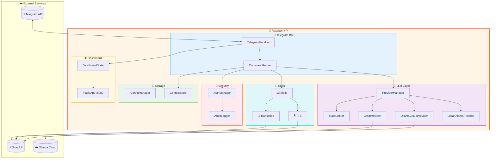

<p align="center">
  
</p>

<h1 align="center">🤖 OpenClaw-On-Pi</h1>

<p align="center">
  <strong>AI-Powered Telegram Bot with Multi-Provider LLM Support</strong>
<br>
  <em>Designed & Optimized for Raspberry Pi</em>
</p>

<p align="center">
  <a href="#-features">Features</a> •
  <a href="#-quick-start">Quick Start</a> •
  <a href="#-architecture">Architecture</a> •
  <a href="#-commands">Commands</a> •
  <a href="#-dashboard">Dashboard</a>
</p>

<p align="center">
  
  
  
  
</p>

<p align="center">
  
  
  
  
  
</p>

---

## 🌟 What is OpenClaw?

OpenClaw is a **production-ready AI chatbot** that runs on your Raspberry Pi and connects to Telegram. It intelligently routes requests between multiple LLM providers (Groq, Ollama Cloud, Local Ollama) with automatic failover, rate limiting, and a beautiful web dashboard for monitoring.

```
┌─────────────────────────────────────────────────────────────────┐
│  🍓 Your Raspberry Pi                                           │
│  ┌─────────────┐    ┌─────────────┐    ┌─────────────┐         │
│  │   Telegram  │───▶│  OpenClaw   │───▶│  Dashboard  │         │
│  │     Bot     │    │   Engine    │    │   :8080     │         │
│  └─────────────┘    └──────┬──────┘    └─────────────┘         │
│                            │                                    │
│         ┌──────────────────┼──────────────────┐                │
│         ▼                  ▼                  ▼                │
│  ┌─────────────┐    ┌─────────────┐    ┌─────────────┐         │
│  │    Groq    │    │   Ollama    │    │   Local     │         │
│  │  LLM+Audio  │    │   Cloud     │    │   Ollama    │         │
│  │   ⚡🎙️      │    │   ☁️ Free   │    │     🖥️      │         │
│  └─────────────┘    └─────────────┘    └─────────────┘         │
└─────────────────────────────────────────────────────────────────┘
```

---

## ✨ Features

| Feature | Description |
|---------|-------------|
| 🧠 **Multi-Provider AI** | Groq (blazing fast), Ollama Cloud (18+ models, free), Local Ollama (privacy) |
| 🎙️ **Text-to-Speech** | Convert text to lifelike audio with Groq Orpheus TTS (6 voices + vocal directions) |
| 🎤 **Voice Transcription** | Transcribe voice messages and audio files with Groq Whisper |
| 🔄 **Smart Failover** | Automatic switching on rate limits or errors |
| ⚡ **Rate Limiting** | Sliding window algorithm with proactive failover at 80% |
| 🔐 **Permission System** | Admin, User, Guest roles with granular access |
| 💬 **Context Memory** | Persistent conversations with token-aware truncation |
| 📊 **Web Dashboard** | Beautiful glassy ivory-orange monitoring UI |
| 📝 **Audit Logging** | Complete activity tracking with PII redaction |
| 🎨 **Professional CLI** | Colorful interface with emojis |
| 🧪 **248 Tests** | Comprehensive test coverage with Hypothesis |

---

## 🎬 CLI Preview

<p align="center">
  
</p>

---

## 🚀 Quick Start

### Install & Run (3 commands)

```bash
git clone https://github.com/sharvinzlife/OpenClaw-On-Pi.git
cd OpenClaw-On-Pi
./setup
```

`./setup` automatically handles everything:
- ✅ Checks Python 3.9+ is installed
- ✅ Installs [uv](https://docs.astral.sh/uv/) (fast Python package manager) if not present
- ✅ Installs all dependencies (`uv sync`)
- ✅ Creates `config/.env` from template
- ✅ Launches the interactive CLI wizard to configure API keys

After setup, start the bot:

```bash
./start
```

Dashboard available at `http://your-pi-ip:8080`

> **No manual dependency installation needed.** `./setup` and `./start` handle everything automatically.

### What You Need

| Requirement | Where to get it | Cost |
|-------------|----------------|------|
| 🍓 Raspberry Pi (or any Linux) | Python 3.9+ required | — |
| 🤖 Telegram Bot Token | [@BotFather](https://t.me/BotFather) on Telegram | Free |
| ⚡ Groq API Key | [console.groq.com](https://console.groq.com) | Free |
| ☁️ Ollama Cloud Key | [ollama.com/settings/keys](https://ollama.com/settings/keys) | Free |
| 🔴 Reddit API (optional) | [reddit.com/prefs/apps](https://www.reddit.com/prefs/apps) | Free |

> **You need at least ONE LLM provider** — either Groq or Ollama Cloud (or both). Both are free.
> Groq is also required for the `/tts` and `/transcribe` audio skills.

### Management Scripts

| Script | What it does |
|--------|-------------|
| `./setup` | Install deps + launch CLI wizard (run once) |
| `./start` | Start bot + dashboard (auto-installs deps if needed) |
| `./stop` | Stop the bot and free port 8080 |
| `./restart` | Restart the bot |

### Manual Installation (Advanced)

If you prefer full control:

```bash
# 1. Clone
git clone https://github.com/sharvinzlife/OpenClaw-On-Pi.git
cd OpenClaw-On-Pi

# 2. Install uv (Python package manager)
curl -LsSf https://astral.sh/uv/install.sh | sh

# 3. Install all dependencies
uv sync

# 4. Configure
cp config/.env.template config/.env
nano config/.env                    # Add your API keys
nano config/permissions.yaml        # Add your Telegram user ID as admin

# 5. Start
./start
```

---

## 🏗️ Architecture




---

## ⚙️ Configuration

### 🔑 API Keys (`config/.env`)

```env
# Required
TELEGRAM_BOT_TOKEN=your_bot_token_from_botfather

# LLM Provider — need at least ONE (both are free!)
GROQ_API_KEY=your_groq_api_key          # Also needed for /tts and /transcribe
OLLAMA_API_KEY=your_ollama_cloud_key    # Free at ollama.com

# Optional
REDDIT_CLIENT_ID=your_reddit_client_id
REDDIT_CLIENT_SECRET=your_reddit_secret
```

### 👤 Get Your Telegram User ID

1. Message [@userinfobot](https://t.me/userinfobot) on Telegram
2. Copy your user ID
3. Add to `config/permissions.yaml`:

```yaml
admins:
  - 123456789  # Your user ID here
```

---

## 🧠 Available Models

### Groq Models (Chat)

| Model | ID | Context | Speed | Best For |
|-------|-----|---------|-------|----------|
| GPT-OSS 120B | `openai/gpt-oss-120b` | 131K | 500 T/s | General purpose (default) |
| GPT-OSS 20B | `openai/gpt-oss-20b` | 131K | 1000 T/s | Fast general purpose |
| Llama 3.3 70B | `llama-3.3-70b-versatile` | 131K | 280 T/s | Versatile reasoning |
| Llama 3.1 8B | `llama-3.1-8b-instant` | 131K | 560 T/s | Ultra-fast responses |
| Llama 4 Maverick | `meta-llama/llama-4-maverick-17b-128e-instruct` | 131K | 600 T/s | Latest Llama |
| Llama 4 Scout | `meta-llama/llama-4-scout-17b-16e-instruct` | 131K | 750 T/s | Fast Llama 4 |
| Kimi K2 | `moonshotai/kimi-k2-instruct-0905` | 262K | 200 T/s | Long context |
| Qwen3 32B | `qwen/qwen3-32b` | 131K | 400 T/s | Multilingual |
| Compound | `groq/compound` | 131K | 450 T/s | AI system with web search |
| Compound Mini | `groq/compound-mini` | 131K | 450 T/s | Lightweight AI system |

### Groq Audio Models

| Model | ID | Use | Skill |
|-------|-----|-----|-------|
| Orpheus English TTS | `canopylabs/orpheus-v1-english` | Text → Speech | `/tts` |
| Whisper Large V3 Turbo | `whisper-large-v3-turbo` | Speech → Text | `/transcribe` |
| Whisper Large V3 | `whisper-large-v3` | Speech → Text (highest accuracy) | `/transcribe` |

### Ollama Cloud Models (18+ free models)

| Model | Size | Best For |
|-------|------|----------|
| DeepSeek V3.2 | 671B | General reasoning (default) |
| GLM-5 | — | Chinese + English tasks |
| Kimi K2.5 | — | Long context reasoning |
| Cogito 2.1 | 671B | Deep thinking |
| Mistral Large 3 | 675B | Multilingual, code |
| Qwen3 Coder | 480B | Code generation |
| GPT-OSS | 120B | General purpose |
| Gemma 3 | 27B | Lightweight tasks |
| LFM 2.5 Thinking | — | Reasoning |

Switch models from the web dashboard or via Telegram `/models` command.

---

## 🎮 CLI & Management

### Shell Scripts

| Command | Description |
|---------|-------------|
| `./setup` | 🔧 First-time setup — launches the interactive CLI wizard |
| `./start` | 🚀 Start the bot + dashboard (kills any existing instance) |
| `./stop` | 🛑 Stop the bot and free port 8080 |
| `./restart` | 🔄 Restart the bot |

### Interactive CLI Wizard (`./setup`)

The CLI wizard provides a full menu-driven interface:

| Option | Description |
|--------|-------------|
| `[1]` 🚀 Start the bot | Launch bot with startup sequence |
| `[2]` 🔑 Configure API keys | Menu-based key selector with links to get keys |
| `[3]` 🔒 Edit permissions | Manage admin/user Telegram IDs |
| `[4]` ⚙️ Check status | Verify config, API keys, and provider health |
| `[5]` 🧪 Run tests | Execute property-based test suite |
| `[6]` 🌐 Start dashboard only | Launch web dashboard without the bot |

### API Key Configuration

The key configurator shows status for each key and provides direct links:

| Key | Where to Get | Required? |
|-----|-------------|-----------|
| 🤖 Telegram Bot Token | [@BotFather](https://t.me/BotFather) | Yes |
| ⚡ Groq API Key | [console.groq.com/keys](https://console.groq.com/keys) | For audio skills |
| 🔑 Ollama Cloud API Key | [ollama.com/settings/keys](https://ollama.com/settings/keys) | Alternative LLM |
| 🔴 Reddit Keys | [reddit.com/prefs/apps](https://www.reddit.com/prefs/apps) | For /reddit |

> Need at least one of Groq or Ollama Cloud. Both are free!

### CLI Preview

<p align="center">
  
</p>

---

## 🤖 Telegram Commands

### 💬 Chat Commands
| Command | Description |
|---------|-------------|
| `/start` | 👋 Welcome message and quick start guide |
| `/help` | 📚 Show available commands for your role |
| `/status` | 📊 Bot status and current provider |
| `/provider` | 🧠 Show active AI provider details |
| `/switch <name>` | 🔄 Switch to different AI provider |
| `/models` | 📋 List available AI models |
| `/reset` | 🗑️ Clear your conversation history |
| `/quota` | 📈 Check your rate limit status |

### 🎯 Skills
| Command | Description | Requires |
|---------|-------------|----------|
| `/tts [voice:name] <text>` | 🎙️ Convert text to speech audio | Groq |
| `/transcribe` | 🎤 Transcribe voice/audio (reply to a voice msg) | Groq |
| `/weather <city>` | 🌤️ Current weather | — |
| `/wiki <topic>` | 📖 Wikipedia summary | — |
| `/news` | 📰 Latest headlines | — |
| `/crypto <coin>` | 💰 Cryptocurrency prices | — |
| `/translate <text>` | 🌐 Translate text | — |
| `/calc <expr>` | 🧮 Calculator | — |
| `/reddit <sub>` | 🔴 Reddit posts | Reddit API |
| `/ytdl <url>` | 📥 Download YouTube video/audio | — |
| `/ocr` | 📷 Extract text from images | — |
| `/run <code>` | 🐍 Run Python code (admin) | — |
| `/sysinfo` | 💻 System information (admin) | — |

### 🎙️ TTS Voices

The `/tts` skill supports 6 English voices with vocal direction tags:

| Voice | Description |
|-------|-------------|
| `troy` | Male (default) |
| `tara` | Female |
| `leah` | Female |
| `leo` | Male |
| `jess` | Female |
| `mia` | Female |

**Vocal directions:** Wrap in brackets to control tone:
```
/tts [cheerful] Welcome to OpenClaw!
/tts voice:tara [whisper] This is a secret message
/tts voice:leo [excited] We just shipped a new feature!
```

### 👑 Admin Commands
| Command | Description |
|---------|-------------|
| `/stats` | 📊 Global usage statistics |
| `/users` | 👥 List all active users |
| `/broadcast <msg>` | 📢 Send message to all users |
| `/reload` | 🔄 Reload configuration files |
| `/audit [n]` | 📝 View last n audit log entries |
| `/health` | 🏥 System health check |
| `/ban <id>` | 🚫 Ban a user |
| `/unban <id>` | ✅ Unban a user |

---

## 📊 Web Dashboard

Access the monitoring dashboard at `http://your-pi-ip:8080`

### Features

- 🟢 **Real-time Status** - Bot online/offline indicator
- ⏱️ **Uptime Counter** - How long the bot has been running
- 💬 **Message Counter** - Total messages processed
- 🎯 **Token Usage** - Tokens consumed across providers
- 👥 **Active Users** - Currently active user count
- 🧠 **Provider Status** - Health of each AI provider with active toggle
- 🔄 **Model Switching** - Change AI models per provider from the UI
- 📊 **Rate Limits** - Visual progress bars for limits
- 📝 **Activity Feed** - Recent bot activity stream

### Design

Beautiful **glassy ivory-orange** design with:
- Animated floating orbs background
- Glassmorphism panels
- Responsive layout for mobile
- Auto-refresh every 5 seconds

---

## 🍓 Raspberry Pi Compatibility

| Model | Architecture | Status |
|-------|--------------|--------|
| Pi 5 | ARM64 | ✅ Tested |
| Pi 4 | ARM64 | ✅ Tested |
| Pi 3 | ARM64/ARM32 | ✅ Compatible |
| Pi Zero 2 W | ARM64 | ✅ Compatible |
| Pi Zero W | ARM32 | ⚠️ Limited (no local Ollama) |

### Supported Operating Systems

- 🥧 **DietPi** (Recommended - lightweight)
- 🍓 **Raspberry Pi OS** (64-bit or 32-bit)
- 🐧 **Ubuntu Server** (ARM64)
- 🐧 **Debian** (ARM64)

---

## 🧪 Testing

OpenClaw includes **248 tests** (property-based + unit) using [Hypothesis](https://hypothesis.readthedocs.io/).

```bash
# Run all tests
uv run pytest tests/ -v

# Run specific test file
uv run pytest tests/property/test_auth_properties.py -v
```

### Test Coverage

| Module | Tests | Coverage |
|--------|-------|----------|
| 🔐 Authentication | 9 | Allowlist, lockout, hierarchy |
| ⚡ Rate Limiting | 9 | Sliding window, failover threshold |
| 🧠 Provider Routing | 9 | Priority, failover, recovery |
| 💬 Context Store | 7 | Isolation, truncation, persistence |
| ⚙️ Configuration | 3 | Loading, validation |
| 📝 Audit Logging | 8 | Completeness, PII redaction |
| 🎮 Commands | 5 | Permission filtering |
| 🔒 Clone Export | 15 | Secret detection, archive validation |
| 📊 Dashboard | 8 | API endpoints, model switching |
| 🧮 Skills | 30+ | Calculator, weather, sysinfo, etc. |

---

## 📁 Project Structure

```
OpenClaw-On-Pi/
├── 📁 config/                    # Configuration files
│   ├── .env.template            # API keys template
│   ├── config.yaml              # App settings
│   ├── providers.yaml           # LLM provider config
│   ├── skills.yaml              # Skill settings
│   └── permissions.yaml         # User permissions
│
├── 📁 src/                       # Source code
│   ├── 📁 bot/                   # Telegram bot
│   │   ├── command_router.py    # 16 commands
│   │   └── telegram_handler.py  # Message handling
│   │
│   ├── 📁 llm/                   # LLM providers
│   │   ├── groq_provider.py     # Groq (chat + audio)
│   │   ├── ollama_cloud_provider.py
│   │   ├── ollama_local_provider.py
│   │   ├── provider_manager.py  # Failover logic
│   │   └── rate_limiter.py      # Sliding window
│   │
│   ├── 📁 skills/                # 13 Skills
│   │   ├── tts.py               # 🎙️ Text-to-Speech (Orpheus)
│   │   ├── transcribe.py        # 🎤 Voice transcription (Whisper)
│   │   ├── weather.py           # 🌤️ Weather
│   │   ├── wiki.py              # 📖 Wikipedia
│   │   ├── news.py              # 📰 News
│   │   ├── crypto.py            # 💰 Crypto prices
│   │   ├── translate.py         # 🌐 Translation
│   │   ├── reddit.py            # 🔴 Reddit
│   │   ├── ytdl.py              # 📥 YouTube download
│   │   ├── ocr.py               # 📷 OCR
│   │   ├── calc.py              # 🧮 Calculator
│   │   ├── python_runner.py     # 🐍 Python sandbox
│   │   └── sysinfo.py           # 💻 System info
│   │
│   ├── 📁 security/              # Security
│   │   └── auth.py              # Permissions + lockout
│   │
│   ├── 📁 utils/                 # Utilities
│   │   ├── config_manager.py    # YAML + ENV loading
│   │   ├── context_store.py     # Conversation memory
│   │   └── audit_logger.py      # Activity logging
│   │
│   ├── 📁 web/                   # Dashboard
│   │   └── dashboard.py         # Flask app
│   │
│   ├── cli.py                   # Professional CLI
│   └── main.py                  # Entry point
│
├── 📁 tests/                     # 248 tests
│   ├── 📁 property/              # Hypothesis property tests
│   ├── 📁 unit/                  # Unit tests
│   └── 📁 integration/           # Integration tests
│
├── 📄 start / stop / restart     # Management scripts
├── 📄 setup                      # First-time setup wizard
└── 📄 pyproject.toml             # Project config (uv)
```

---

## 📈 Roadmap

- [x] Multi-provider LLM support
- [x] Smart failover with rate limiting
- [x] Web dashboard
- [x] Property-based testing (248 tests)
- [x] Ollama Cloud support (18+ free models)
- [x] CLI setup wizard
- [x] UV-based package management
- [x] Dashboard model switching
- [x] 🎙️ Text-to-Speech (Groq Orpheus)
- [x] 🎤 Voice transcription (Groq Whisper)
- [x] 🔴 Reddit skill
- [ ] Image generation (DALL-E/Stable Diffusion)
- [ ] WhatsApp integration
- [ ] Discord bot
- [ ] Prometheus metrics
- [ ] Docker support

---

## 🤝 Contributing

Contributions are welcome! Please feel free to submit a Pull Request.

1. Fork the repository
2. Create your feature branch (`git checkout -b feature/AmazingFeature`)
3. Commit your changes (`git commit -m 'Add some AmazingFeature'`)
4. Push to the branch (`git push origin feature/AmazingFeature`)
5. Open a Pull Request

---

## 📄 License

This project is licensed under the MIT License - see the [LICENSE](LICENSE) file for details.

---

## 🙏 Acknowledgments

Built with these amazing tools:

- [python-telegram-bot](https://python-telegram-bot.org/) - Telegram Bot API wrapper
- [Groq](https://groq.com/) - Lightning-fast LLM inference + audio
- [Ollama](https://ollama.ai/) - Run LLMs locally or in the cloud
- [Flask](https://flask.palletsprojects.com/) - Web dashboard
- [Hypothesis](https://hypothesis.readthedocs.io/) - Property-based testing
- [uv](https://docs.astral.sh/uv/) - Fast Python package manager

---

<p align="center">
  <strong>Made with 🧡 for Raspberry Pi</strong><br>
  <em>by <a href="https://github.com/sharvinzlife">@sharvinzlife</a></em>
</p>

<p align="center">
  <a href="https://github.com/sharvinzlife/OpenClaw-On-Pi/stargazers">⭐ Star this repo</a> •
  <a href="https://github.com/sharvinzlife/OpenClaw-On-Pi/issues">🐛 Report Bug</a> •
  <a href="https://github.com/sharvinzlife/OpenClaw-On-Pi/issues">💡 Request Feature</a>
</p>
